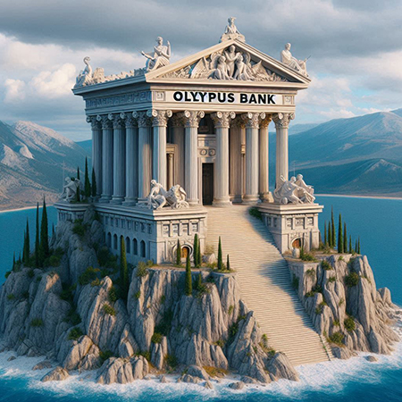

# Olympus Banking

<div align="center">
    
</div>

The Olympus Banking project is a simple financial services platform developed using NestJS and NPM Workspaces for monorepo setup. It utilizes a microservices architecture with Docker containers and is designed to run on AWS Lambda using the Serverless Framework.

### Plutus

<div align="center">
    
</div>

> Plutus is the god of wealth and the guardian of riches. He is often depicted as a youthful figure holding a cornucopia, symbolizing abundance, and a key, symbolizing his control over riches. Plutus is associated with the bounty of the earth and the blessings of agricultural wealth.

In the context of the Olympus Banking, Plutus serves as a microservice responsible for managing accounts and financial transactions operations.

### Hermes

<div align="center">
    
</div>

> Hermes is known as the messenger of the gods, often depicted as a youthful and agile figure adorned with winged sandals and a herald's staff. Hermes acts as a link between the divine and mortal realms, facilitating communication, commerce, and transitions.

In the context of the Olympus Banking, Hermes serves as a microservice responsible for event-driven workflows within the banking ecosystem and report the statements.

## How to run

#### Docker

Ensure Docker is installed on your machine. If not, download and install Docker from Docker's official website.

#### Compose

Olympus Banking leverages Docker Compose capabilities. To run it, execute the following command in your terminal, this will build the Plutus and Hermes images and also run MongoDB and LocalStack instances

```sh
docker compose up -d
```

If you need, you can also build the images skiping Docker's cache

```sh
docker compose build --no-cache
docker compose up -d
```

#### Swagger

Both Plutus and Hermes have Swagger configured. You can acess it at:

- Plutus: http://localhost:3001/docs
- Hermes: http://localhost:3002/docs

### TODOs and Improvements

This is a simple project that was built in just a couple of hours. Therefore, there are many areas that could be improved. Here are a few examples:

- **Authentication & Authorization**: Neither Plutus nor Hermes currently implement any form of authentication. One approach would be to introduce JWT tokens. With JWT tokens, we could extract the account ID and eliminate the need to pass the account ID in some routes, relying instead on the account information from the token;
- **Tests**: Unit and integration tests are crucial for ensuring code quality and minimizing bugs. Due to time constraints, I opted not to create any tests for this project. In real-world scenarios, it's essential to include time for test creation during the estimation phase;
- **Open-source event-driven solution**: Utilizing AWS EventBridge for event transmission and delivery creates a tight coupling with AWS, making it challenging to integrate with other services. One alternative solution could be employing RabbitMQ Exchanges and Queues for event generation and processing, providing more flexibility and reducing dependency on AWS services;